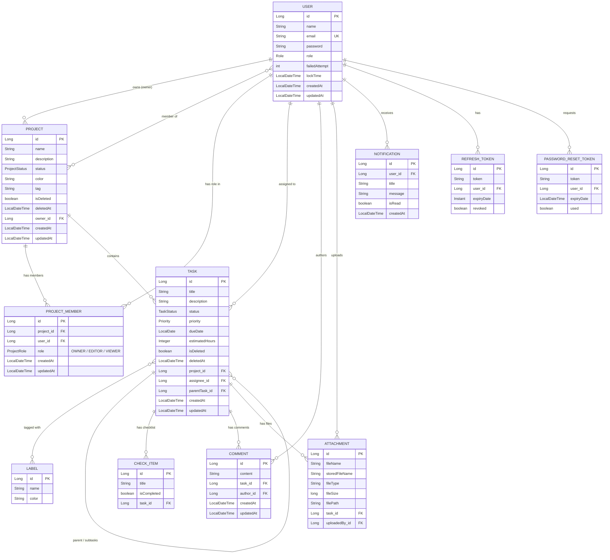

# TaskFlow — ER Diagram

**Notlar**
- `PROJECT.owner_id` → tek bir sahip (OWNER rolü ile eşleşir); `PROJECT_MEMBER` tablosu ayrıca her üyenin rolünü (OWNER/EDITOR/VIEWER) tutar.
- `TASK.parentTask_id` self-referencing ilişki → subtask/duplicate task desteği.
- Soft delete `isDeleted` + `deletedAt` alanları hem `PROJECT` hem `TASK` üzerinde var; sorgular `isDeletedFalse` ile filtreleniyor.
- GitHub bu Mermaid bloğunu doğrudan render eder; farklı bir görsel istersen (PNG/draw.io) ayrıca üretebilirim.
